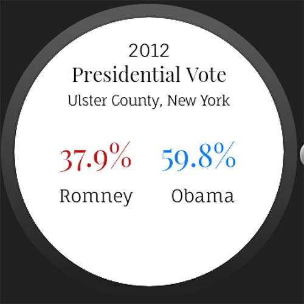

# PROG 02: Represent!

The Represent! app allows for a user to get to know the congressional representatives for their county. Details such as supported bills, committees, and contact information are displayed for each representative found. There is a watch app designed for the Moto 360 that is counterpart to the mobile phone, allowing users to swipe through and select a representative from their wrist.

## Authors

Maura Fitzgerald ([maurafitzgerald@berkeley.edu](mailto:your_email@berkeley.edu))

## Demo Video

See [a demo of the Represent! app] (https://youtu.be/mYIkFen2q_k)

## Screenshots

## Acknowledgments

* Thilo Köhler, StackOverflow - Detecting watch shake
